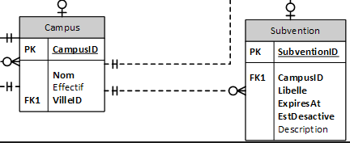
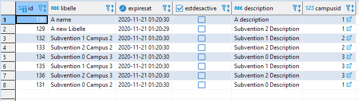

# Devoir de Database Application : Coop'Pain appliqué au TP2

## Sujet

- 2 Entités relié par une association
- **"On limite le nombre de subventions par campus"**
- J'ai rajouté personnellement la contrainte **"Interdiction d'avoir le champs libellé de Subvention en dupliqué sur la table"** afin de montrer le rollback.
- **Contraintes du TP 2 adapté au sujet :**
  - "Ecrire un bean session qui permet de faire **une subvention**. Pour cela, vous écrivez deux Entities **Campus et Subvention**, une interface **GestionSubvention** et une implémentation de l'interface en un bean Session. L'interface propose de créer une session **d'ajout/modification/suppression de Subvention** en fournissant **l'ID du Campus**, puis des méthodes pour **CRUD (Create, Read, Update, Delete)** les subventions liés à ce campus en précisant si nécessaire **l'ID de la Subvention**. A la création de la session, on transmettra le l'ID du Campus et conservera dans le bean la référence sur le campus concerné."
  - "Ajouter la possibilité de connaitre la **Subvention** en fournissant son ID, ainsi qu'une méthode qui donne la **liste des Subventions**. Pour cela, vous écrirez une nouvelle interface **InfosSubvention** et son implémentation."
  - "Modifier la méthode **createSubvention** afin qu’elle vérifie d’abord si le nombre maximum de subvention n’est pas atteint. Fixer ce nombre à la valeur constante 3 pour l’instant. La méthode **createSubvention**, qui devra maintenant lever une exception **SubventionLimitReachedException** (nouvelle à écrire), teste d’abord si le nombre n’est pas atteint avant de créer la Subvention. Ajouter à la suite une deuxième exception **LibelleConflictException** à aux méthodes **create/update** qui n’autorise pas **la création/modification d'une subvention portant le même libellé**. Constatez que toute modification de la subvention (qui a normalement eu lieu à l'étape précédente) est annulée. Vérifier que la création d’une nouvelle subvention avec un numéro d’emprunteur n’existant pas dans la base provoque une exception". 

## Contexte de donnée



La relation Subvention-Campus est OneToMany, avec la clé étrangère de Subvention *CampusID[FK1]* non nullable.

**Une subvention ne doit pas exister sans campus existant.**

<div style="page-break-after: always; break-after: page;"></div>

## Configuration initiale

Les commandes seront sous format Windows.

### Création de la database

La database est configuré de la manière suivante :

| Variable Keys             | Values   | Commentaires                                                 |
| ------------------------- | -------- | ------------------------------------------------------------ |
| POSTGRES_USER             | cooppain | Identifiant de connexion au serveur PostgreSQL               |
| POSTGRES_PASSWORD         | cooppain | Mot de passe de connexion au serveur PostgreSQL              |
| POSTGRES_DB               | cooppain | Nom de la database du projet                                 |
| POSTGRES_HOST_AUTH_METHOD | trust    | [Trust Authentication](https://www.postgresql.org/docs/13/auth-trust.html) |
| PORT                      | 5432     | Port par défaut de PostgreSQL                                |

### Création de la table et initialisation

Comme nous travaillons uniquement avec 2 entités pour cette étude, nous allons alléger les contraintes par rapport à Database Design (la clé étrangère VilleID ne référence aucune table).

```plsql
CREATE TABLE Campus (
  ID SERIAL PRIMARY KEY,
  Nom VARCHAR(255) NOT NULL,
  Effectif INT,
  VilleID INT
);

CREATE TABLE Subvention (
  ID SERIAL PRIMARY KEY,
  Libelle VARCHAR(255) NOT NULL,
  ExpiresAt TIMESTAMP NOT NULL,
  EstDesactive BOOLEAN NOT NULL,
  Description VARCHAR(255),
  CampusID INT NOT NULL
);
ALTER TABLE Subvention
ADD CONSTRAINT Subvention_CampusID_FK FOREIGN KEY (CampusID) REFERENCES Campus (ID);
```

```plsql
INSERT INTO Campus (Nom, Effectif, VilleID) VALUES ('Campus1', 1, 1);
INSERT INTO Campus (Nom, Effectif, VilleID) VALUES ('Campus2', 2, 2);
INSERT INTO Campus (Nom, Effectif, VilleID) VALUES ('Campus3', 3, 3);
```

<div style="page-break-after: always; break-after: page;"></div>

### Création de la JDBC Connection Pool

Installez le driver JDBC de PostgreSQL dans le glassfish 5 (Le driver utilisé est *[PostgreSQL JDBC 4.2 Driver, 42.2.18](https://jdbc.postgresql.org/download/postgresql-42.2.18.jar)*) en copiant la librarie dans `[glassfish_root]\glassfish\domains\domain1\lib`.

Démarrez le domaine :

```bat
asadmin start-domain
```

Créez la JDBC Connection Pool.

```bat
asadmin create-jdbc-connection-pool --datasourceclassname org.postgresql.ds.PGSimpleDataSource --restype javax.sql.ConnectionPoolDataSource --property portNumber=5432:password=cooppain:user=cooppain:serverName=localhost:databaseName=cooppain cooppainPool
```

### Création de la JDBC Resource

```bat
asadmin create-jdbc-resource --connectionpoolid cooppainPool jdbc/cooppain
```

## Compiler et Déployer les beans

Pour compiler :

```bat
set CLASSPATH=".;%GLASSFISH_ROOT%\glassfish\lib\javaee.jar;%GLASSFISH_ROOT%\glassfish\lib\appserv-rt.jar;%GLASSFISH_ROOT%\glassfish\lib\gf-client.jar"

del /F /Q /S build\*

javac -classpath %CLASSPATH% -d build cooppain\entities\*.java cooppain\exceptions\*.java cooppain\sessions\*.java cooppain\sessions\impl\*.java
del build\cooppain\entities\*_.class build\cooppain\exceptions\*_.class build\cooppain\sessions\*_.class build\cooppain\sessions\impl\*_.class

xcopy /s /i ".\META-INF" ".\build\META-INF"

cd build
jar cvf CoopPainEJB.jar META-INF\*.xml cooppain\entities\*.class cooppain\exceptions\*.class cooppain\sessions\*.class cooppain\sessions\impl\*.class
```

Pour déployer :

```bat
asadmin deploy --force build\CoopPainEJB.jar
```

<div style="page-break-after: always; break-after: page;"></div>

## Compiler et Déployer le client

Pour compiler :

```bat
set CLASSPATH=".;.\CoopPainEJB.jar;%GLASSFISH_ROOT%\glassfish\lib\javaee.jar;%GLASSFISH_ROOT%\glassfish\lib\appserv-rt.jar;%GLASSFISH_ROOT%\glassfish\lib\gf-client.jar"

xcopy /Y ..\Serveur\build\CoopPainEJB.jar .\
javac -classpath %CLASSPATH% Client.java
```

Pour lancer :

```bat
set CLASSPATH=".;.\CoopPainEJB.jar;%GLASSFISH_ROOT%\glassfish\lib\javaee.jar;%GLASSFISH_ROOT%\glassfish\lib\appserv-rt.jar;%GLASSFISH_ROOT%\glassfish\lib\gf-client.jar"

java -classpath %CLASSPATH% Client
```

<div style="page-break-after: always; break-after: page;"></div>

## Observations et Résultats

Nous rappelons les deux règles de gestions :

- **"On limite le nombre de subventions par campus"**
- **"Interdiction d'avoir le champs libellé de Subvention en dupliqué sur la table"**

### Initialisation

En lançant le Client, nous obtenons : 

```sh
Clear all subventions.
Subventions deleted: 8
```

Cela a réussi à supprimer mes anciens Subventions issues de mes anciens tests.

```sh
Init. Using :
Campus{id=1, nom='Campus1', effectif=1, villeId=1}
```

Notre bean Session Stateful gère maintenant "Campus 1".

### TEST: Create max subventions

Résultat :

```sh
Subvention{id=127, libelle='Subvention 0', expiresAt=2020-11-21 01:20:29.58, estDesactive=false, description='Subvention 0 Description', campusID=1}

Subvention{id=128, libelle='Subvention 1', expiresAt=2020-11-21 01:20:29.799, estDesactive=false, description='Subvention 1 Description', campusID=1}

Subvention{id=129, libelle='Subvention 2', expiresAt=2020-11-21 01:20:29.858, estDesactive=false, description='Subvention 2 Description', campusID=1}
OK
```

Il a créée le nombre max de Subvention que j'avais inscrit dans le `ejb-jar.xml`.

Cela prouve :

- La variable définie dans `ejb-jar.xml` a été injecté parfaitement dans le bean `GestionSubventionImpl` et est récupérable avec la méthode `getSubventionLimit()`.
- `createSubvention()` fonctionne dans le cas favorable

### TEST: Create more subvention that he can take. Should throw.

Résultat :

```sh
OK : cooppain.exceptions.SubventionLimitReachedException: Subvention limit reached
```

Nous avons ajouté une subvention au campus 1. Or, il avait déjà atteint le max avec la dernière partie. Par conséquent, l'erreur qui est subvenue est bien celui que l'on attend !

### TEST: Remove 2 subventions that campus has.

Résultat :

```sh
DELETED : [
Subvention{id=127, libelle='Subvention 0', expiresAt=2020-11-21 01:20:29.58, estDesactive=false, description='Subvention 0 Description', campusID=1},
Subvention{id=128, libelle='Subvention 1', expiresAt=2020-11-21 01:20:29.799, estDesactive=false, description='Subvention 1 Description', campusID=1}]
LEFT : [
Subvention{id=129, libelle='Subvention 2', expiresAt=2020-11-21 01:20:29.858, estDesactive=false, description='Subvention 2 Description', campusID=1}]
OK
```

Il ne reste que la "Subvention 2". La méthode de suppression fonctionne parfaitement.

### TEST: Create a subvention that has the same name as another. Should throw. Creation should be rollbacked.

Résultat :

```sh
Subvention{id=130, libelle='A name', expiresAt=2020-11-21 01:20:30.036, estDesactive=false, description='A description', campusID=1}
OK : cooppain.exceptions.LibelleConflictException: Libelle Conflict
SUBTEST: 'A subvention that has the same name.' should not exists.
[
Subvention{id=129, libelle='Subvention 2', expiresAt=2020-11-21 01:20:29.858, estDesactive=false, description='Subvention 2 Description', campusID=1},
Subvention{id=130, libelle='A name', expiresAt=2020-11-21 01:20:30.036, estDesactive=false, description='A description', campusID=1}]
OK
```

Ici, nous avons tenté de créer 2 subventions portant le libellé "A name". Comme la subventions portant la description 'A subvention that has the same name.' n'est pas apparu. La création a bien été annulée.

### TEST: Edit a subvention should work.

Résultat :

```sh
Subvention{id=129, libelle='A new Libelle', expiresAt=2020-11-21 01:20:29.858, estDesactive=false, description='Subvention 2 Description', campusID=1}
OK
```

Le libellé de la subvention 129 à changé de 'Subvention 2' à 'A new Libelle'. La modification fonctionne donc dans le meilleurs des cas.

### TEST: Edit a subvention and change Libelle as duplicate. Should throw. Edit should be rollbacked.

Résultat :

```sh
OK : cooppain.exceptions.LibelleConflictException: Libelle Conflict
SUBTEST: Shouldn't have duplicated libelle. (Should have rollbacked)
[
Subvention{id=130, libelle='A name', expiresAt=2020-11-21 01:20:30.036, estDesactive=false, description='A description', campusID=1},
Subvention{id=129, libelle='A new Libelle', expiresAt=2020-11-21 01:20:29.858, estDesactive=false, description='Subvention 2 Description', campusID=1}]
OK
```

Ici, la subvention 130 a tenté de prendre le nom de la subvention 129.  En regardant, l'implémentation de `updateSubvention` :

```java
@Override
public Subvention updateSubvention(Subvention subvention) throws LibelleConflictException, SubventionLimitReachedException {
    if (subvention == null) {
        throw new IllegalArgumentException("subvention shouldn't be null.");
    }
    if (campusSession == null) {
        throw new NullPointerException("campusSession is null. Did you called `.init(int campusID)` at least once?");
    }

    subvention.setCampusID(campusSession.getId());

    if (countSubventions() < subventionLimit) {
        subvention = em.merge(subvention);
    } else {
        throw new SubventionLimitReachedException();
    }

    if (!infosSubvention.findLibelleExcluding(subvention.getId()).contains(subvention.getLibelle())) {
        subvention = em.merge(subvention);
    } else {
        throw new LibelleConflictException();
    }
    em.flush();
    return subvention;
}
```

Nous remarquons que `subvention = em.merge(subvention)` a déjà été appelé une fois, car `SubventionLimitReachedException` n'a pas été jeté.

Cependant, le résultat démontre que **subvention est revenu à l'état antécédant.**

Nous avons donc bien obtenu la bonne erreur et nous avons *rollback*.

### TEST: Create subvention to an another campus. Change to a new campus and reach the limit. Should throw. Edit should be rollbacked.

```sh
Using :
Campus{id=2, nom='Campus2', effectif=2, villeId=2}
Using :
Campus{id=3, nom='Campus3', effectif=3, villeId=3}
Subventions that will be moved to campus 1 :
[
Subvention{id=131, libelle='Subvention 0 Campus 2', expiresAt=2020-11-21 01:20:30.224, estDesactive=false, description='Subvention 0 Description', campusID=2},
Subvention{id=132, libelle='Subvention 1 Campus 2', expiresAt=2020-11-21 01:20:30.273, estDesactive=false, description='Subvention 1 Description', campusID=2},
Subvention{id=133, libelle='Subvention 2 Campus 2', expiresAt=2020-11-21 01:20:30.321, estDesactive=false, description='Subvention 2 Description', campusID=2},
Subvention{id=134, libelle='Subvention 0 Campus 3', expiresAt=2020-11-21 01:20:30.383, estDesactive=false, description='Subvention 0 Description', campusID=3},
Subvention{id=135, libelle='Subvention 1 Campus 3', expiresAt=2020-11-21 01:20:30.43, estDesactive=false, description='Subvention 1 Description', campusID=3},
Subvention{id=136, libelle='Subvention 2 Campus 3', expiresAt=2020-11-21 01:20:30.515, estDesactive=false, description='Subvention 2 Description', campusID=3}]
Using :
Campus{id=1, nom='Campus1', effectif=1, villeId=1}

Subvention{id=131, libelle='Subvention 0 Campus 2', expiresAt=2020-11-21 01:20:30.224, estDesactive=false, description='Subvention 0 Description', campusID=1}
OK : cooppain.exceptions.SubventionLimitReachedException: Subvention limit reached
SUBTEST: Subvention 132 should have rollbacked.
[
Subvention{id=130, libelle='A name', expiresAt=2020-11-21 01:20:30.036, estDesactive=false, description='A description', campusID=1},
Subvention{id=129, libelle='A new Libelle', expiresAt=2020-11-21 01:20:29.858, estDesactive=false, description='Subvention 2 Description', campusID=1},
Subvention{id=132, libelle='Subvention 1 Campus 2', expiresAt=2020-11-21 01:20:30.273, estDesactive=false, description='Subvention 1 Description', campusID=2},
Subvention{id=133, libelle='Subvention 2 Campus 2', expiresAt=2020-11-21 01:20:30.321, estDesactive=false, description='Subvention 2 Description', campusID=2},
Subvention{id=134, libelle='Subvention 0 Campus 3', expiresAt=2020-11-21 01:20:30.383, estDesactive=false, description='Subvention 0 Description', campusID=3},
Subvention{id=135, libelle='Subvention 1 Campus 3', expiresAt=2020-11-21 01:20:30.43, estDesactive=false, description='Subvention 1 Description', campusID=3},
Subvention{id=136, libelle='Subvention 2 Campus 3', expiresAt=2020-11-21 01:20:30.515, estDesactive=false, description='Subvention 2 Description', campusID=3},
Subvention{id=131, libelle='Subvention 0 Campus 2', expiresAt=2020-11-21 01:20:30.224, estDesactive=false, description='Subvention 0 Description', campusID=1}]
OK
```

Dans ce test, 3 subventions sont créées dans "Campus 2" et 3 subventions sont créées dans "Campus 3". Nous déplaçons ces 6 subventions dans campus 1 pour dépasser la limite inscrite (max=3).

Comme campus 1 possède déjà 2 subventions, la subvention 131 a pu être modifié et appartenir au campus 1. Cependant, la subvention 132 n'a pas pu être modifié et est revenu à l'état antérieur.

## Conclusion

Contenu final de la base de donnée :



Nous remarquons que nos règles de gestions sont toutes respectés.

Toutes les consignes de l'exercice sont également respectés.

